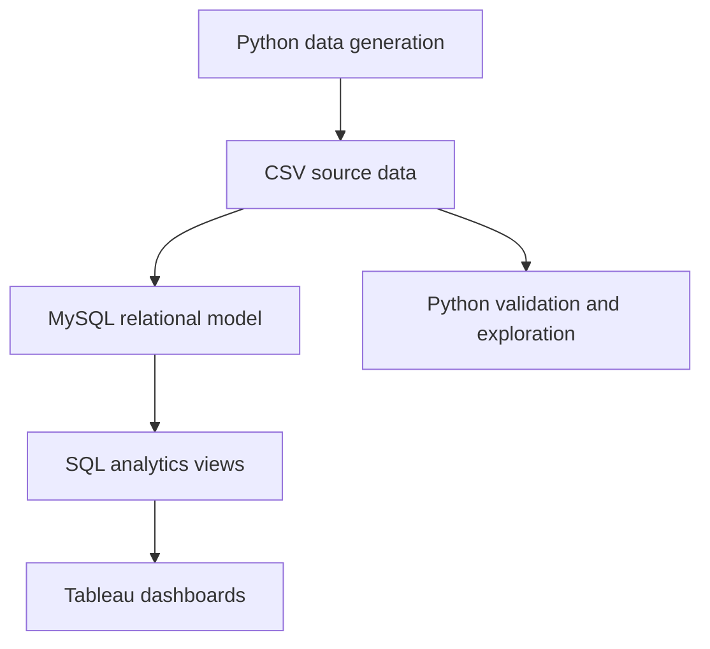
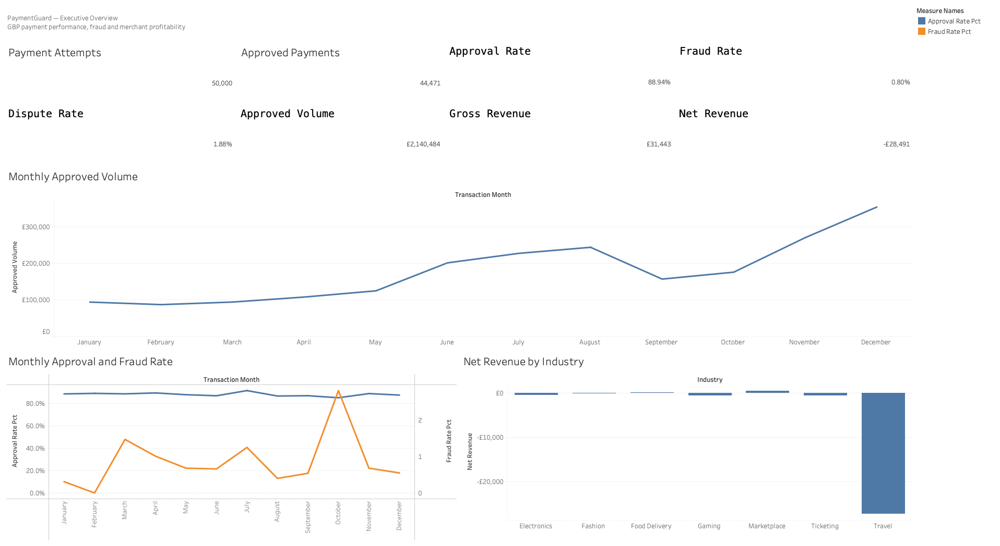
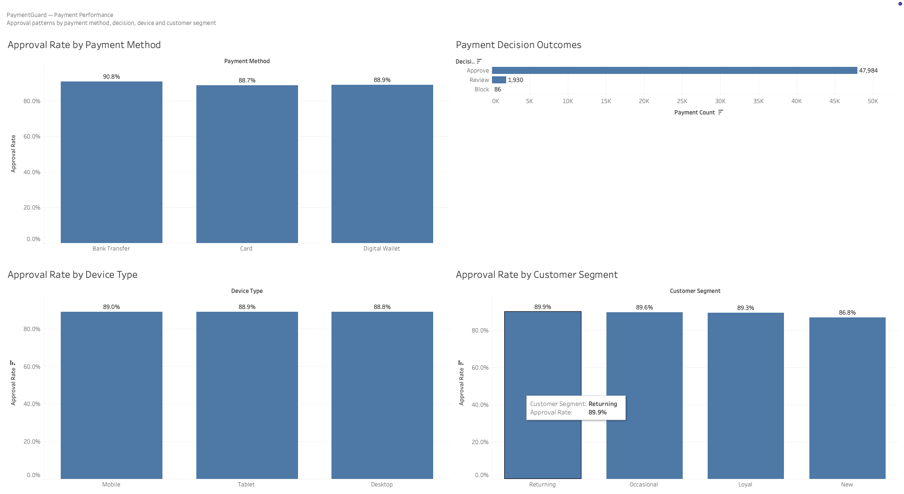
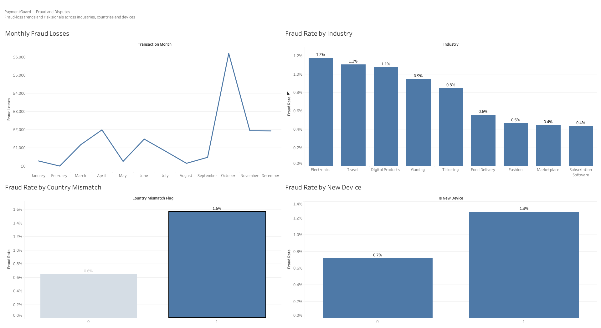
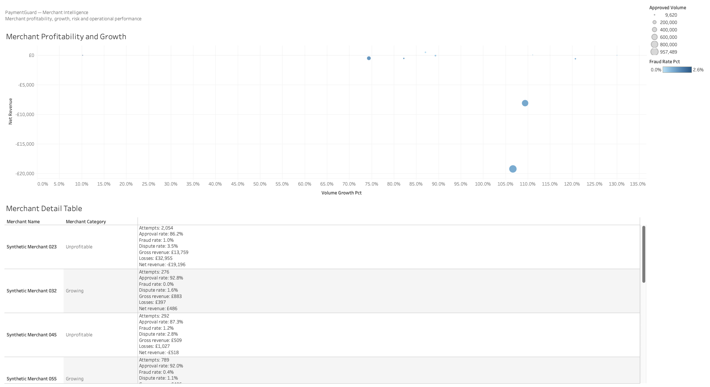
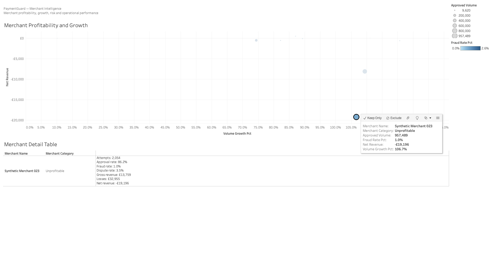

# PaymentGuard: Payment Performance, Fraud and Merchant Intelligence

PaymentGuard is an end-to-end synthetic payments analytics project inspired by the operational challenges faced by payment-service providers and platforms.

The project combines Python data generation, validation, SQL modelling, business analysis and interactive Tableau dashboards to examine three connected questions:

1. How effectively are payments being approved?
2. Where are fraud and dispute losses concentrated?
3. Which merchants create sustainable value after risk costs?

> This project uses entirely synthetic data. It does not contain or represent Stripe customer data or Stripe’s actual business performance.

## Project Overview

PaymentGuard simulates one year of payment activity from 1 January to 31 December 2025.

The generated dataset contains:

- 100 merchants
- 10,000 customers
- 50,000 payments
- 834 disputes
- Multiple currencies, countries, industries, payment methods and customer segments

The analysis follows the complete path from transaction generation to executive decision support.



## Technology Stack

- Python
- pandas
- NumPy
- Jupyter Notebook
- MySQL
- SQL
- Tableau Public
- Git and GitHub

## Data Model

The core model contains four related datasets:

- `merchants`: merchant profile, industry, geography, platform type and risk category
- `customers`: customer geography, account history and customer segment
- `payments`: transaction, payment method, authentication, device, geography, risk and outcome data
- `disputes`: dispute reason, status, fees, recovery and net dispute loss

Relationships:

```text
merchants  1 ──── many  payments
customers  1 ──── many  payments
payments   1 ──── zero-or-one disputes
```

## Analytical Workflow

### 1. Synthetic data generation

Python scripts generate realistic but artificial payment data with controlled relationships between risk signals and outcomes.

Examples of simulated payment features include:

- Payment amount and currency
- Payment method and card network
- Issuer, billing and IP countries
- Cross-border and country-mismatch flags
- Device type and new-device status
- Customer history and segment
- Transaction velocity
- Authentication method and result
- Risk score and payment decision
- Authorisation, fraud, refund and settlement outcomes

### 2. Data validation

The validation notebook checks:

- Primary-key uniqueness
- Missing values
- Merchant and customer relationships
- Payment-to-dispute relationships
- Valid categories and binary flags
- Date ranges
- Non-negative financial values
- Dataset dimensions and reconciliation totals

### 3. SQL modelling

The SQL layer creates reusable analytics views, including:

- `payment_enriched`
- `monthly_performance`
- `merchant_performance`

These views separate transaction-level processing from business-facing metrics and support consistent reporting across dashboards.

### 4. Business analysis

SQL and Tableau are used to analyse:

- Approval rates
- Internal payment decisions
- Payment-method performance
- Customer and device behaviour
- Fraud and dispute exposure
- Monthly loss patterns
- Merchant growth and profitability
- Industry-level economics

## Tableau Dashboards

### Executive Overview



Provides a consolidated view of payment volume, approval, fraud, disputes, revenue and monthly trends.

Key metrics include:

- 50,000 payment attempts
- 44,471 approved payments
- 88.94% approval rate
- 0.80% fraud rate
- 1.88% dispute rate
- £2,140,484 GBP approved volume
- £31,443 GBP gross processing revenue
- -£28,491 GBP net revenue

### Payment Performance



Compares approval performance across payment methods, devices and customer segments, while separating internal payment decisions from final authorisation outcomes.

### Fraud and Disputes



Highlights monthly fraud losses and the relationship between fraud and industry, country mismatch and new-device usage.

### Merchant Intelligence



Combines merchant growth, approved volume, fraud risk and net revenue in an interactive scatter plot and detail table.

The dashboard categorises merchants as:

- Strategic
- Growing
- Monitor
- High Risk
- Unprofitable

### Merchant Drill-Down



Selecting a merchant bubble filters the operational detail table, demonstrating how portfolio-level monitoring can support individual merchant investigation.

## Key Business Findings

### GBP processing revenue did not cover risk losses

GBP approved volume reached approximately £2.14 million and generated approximately £31,443 in gross processing revenue. Fraud and dispute losses were approximately £59,934, resulting in net revenue of approximately -£28,491.

### Travel was the largest industry-level loss driver

Travel produced substantially more negative net revenue than the other industries, indicating that pricing, reserves and risk controls should be adapted to industry-specific economics.

### October produced an abnormal fraud-loss spike

Fraud losses peaked at approximately £6,200 in October. This should trigger investigation by merchant, country, device and payment method.

### Country mismatch was a strong fraud signal

Country-mismatch transactions recorded approximately 1.6% fraud, compared with approximately 0.6% for transactions without a mismatch.

### New-device payments carried elevated risk

New-device transactions recorded approximately 1.3% fraud, compared with approximately 0.7% for familiar devices.

### New customers had the lowest approval rate

New customers achieved approximately 86.8% approval, compared with 89.9% for returning customers.

### High growth did not guarantee profitability

Synthetic Merchant 023 achieved 106.7% volume growth and approximately £957,489 in approved volume but generated -£19,196 in net revenue after losses.

## Recommendations

- Investigate the October fraud-loss anomaly.
- Review Travel merchants individually.
- Apply step-up authentication when multiple risk signals occur together.
- Monitor new-customer approval and authentication performance.
- Separate internal risk decisions from final authorisation outcomes.
- Alert on sudden changes in approval, fraud losses and merchant profitability.
- Use merchant categories to prioritise commercial and risk interventions.
- Evaluate fraud controls against both loss reduction and false-positive impact.

Detailed findings are available in [`reports/business_findings.md`](reports/business_findings.md).

## Project Structure


paymentguard/
├── data/
│   ├── raw/
│   │   ├── customers.csv
│   │   ├── disputes.csv
│   │   ├── merchants.csv
│   │   └── payments.csv
│   └── processed/
│       ├── industry_summary.csv
│       ├── merchant_performance.csv
│       ├── monthly_performance.csv
│       ├── monthly_summary.csv
│       ├── payment_analysis.csv
│       ├── payment_enriched.csv
│       └── payment_method_summary.csv
├── dashboard/
│   └── PaymentGuard_Dashboard_v9_Packaged.twbx
├── notebooks/
│   ├── 01_data_validation.ipynb
│   └── 02_exploratory_analysis.ipynb
├── python/
│   ├── generate_customers.py
│   ├── generate_disputes.py
│   ├── generate_merchants.py
│   ├── generate_payments.py
│   └── generate_payments_steps10_12.py
├── reports/
│   ├── dashboard_exports/
│   │   ├── 01_executive_overview.png
│   │   ├── 02_payment_performance.png
│   │   ├── 03_fraud_and_disputes.png
│   │   ├── 04_merchant_intelligence.png
│   │   └── 05_merchant_drilldown.png
│   ├── business_findings.md
│   └── data_dictionary.md
├── sql/
│   ├── 01_create_database.sql
│   ├── 02_create_tables.sql
│   ├── 03_load_data.sql
│   ├── 04_create_analytics_views.sql
│   └── 05_business_analysis.sql
├── .gitignore
├── README.md
└── requirements.txt

## Running the Project

Install the Python dependencies:


pip install -r requirements.txt


Generate the datasets in order:


python python/generate_merchants.py
python python/generate_customers.py
python python/generate_payments.py
python python/generate_disputes.py


Run the SQL scripts in MySQL Workbench in numerical order:


01_create_database.sql
02_create_tables.sql
03_load_data.sql
04_create_analytics_views.sql
05_business_analysis.sql


Then open the packaged Tableau workbook:


dashboard/PaymentGuard_Dashboard_v9_Packaged.twbx


## Limitations

- All data is synthetic.
- Financial amounts are not converted between currencies.
- GBP financial metrics are reported separately.
- Relationships demonstrate analytical patterns rather than causal effects.
- The project does not include a production fraud model or real-time decision engine.

## Potential Version 2

A future version could add:

- Streaming payment-event ingestion
- Automated data-quality scoring
- Real-time velocity features
- Fraud-model training and evaluation
- False-positive and approval-impact monitoring
- Human-in-the-loop case review
- Agent-assisted merchant investigation
- Databricks lakehouse implementation

## Skills Demonstrated

- Python data generation and validation
- Relational data modelling
- SQL transformations and reusable analytics views
- Payment and fraud analytics
- Financial reconciliation
- Merchant profitability analysis
- Tableau dashboard development
- Business insight communication