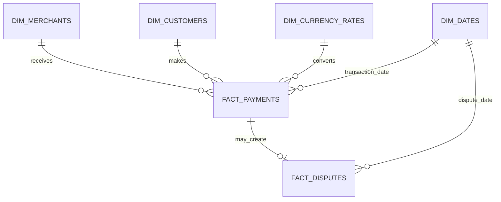

# PaymentGuard Data Dictionary

## 1. Project overview

PaymentGuard is a synthetic payment-performance and fraud-intelligence project.

The model contains:

- 100 synthetic merchants;
- 10,000 synthetic customers;
- 50,000 payment attempts;
- synthetic payment disputes;
- merchant, customer, payment, authentication, risk and dispute information.

No real customer or merchant information is included.

## 2. Data-model principles

The database uses a dimensional model.

The central table is `fact_payments`, where one row represents one payment attempt.

Merchant and customer attributes are stored separately to avoid repeating the same descriptive information across thousands of payment records.

Disputes are stored in a separate fact table because they occur after the original payment.

## 3. Data-model diagram



## 4. Table grains

| Table | Grain |
|---|---|
| `dim_merchants` | One row per merchant |
| `dim_customers` | One row per customer |
| `dim_currency_rates` | One row per currency |
| `dim_dates` | One row per calendar date |
| `fact_payments` | One row per payment attempt |
| `fact_disputes` | One row per dispute |

# Dimension tables

## 5. `dim_merchants`

Source: `data/raw/merchants.csv`

| Column | Type | Constraint | Description |
|---|---|---|---|
| `merchant_id` | VARCHAR(10) | Primary key | Synthetic merchant identifier |
| `merchant_name` | VARCHAR(100) | Not null | Synthetic merchant name |
| `industry` | VARCHAR(50) | Not null | Merchant business sector |
| `merchant_country` | CHAR(2) | Not null | Merchant country code |
| `onboarding_date` | DATE | Not null | Date the merchant joined the platform |
| `merchant_size` | VARCHAR(20) | Not null | Small, Medium or Enterprise |
| `risk_category` | VARCHAR(20) | Not null | Low, Medium or High merchant risk |
| `platform_type` | VARCHAR(30) | Not null | Direct, Marketplace or Subscription |
| `reserve_rate` | DECIMAL(6,4) | 0–1 | Proportion held as merchant reserve |
| `expected_monthly_volume` | DECIMAL(15,2) | Positive | Expected monthly payment volume |

## 6. `dim_customers`

Source: `data/raw/customers.csv`

| Column | Type | Constraint | Description |
|---|---|---|---|
| `customer_id` | VARCHAR(10) | Primary key | Synthetic customer identifier |
| `customer_country` | CHAR(2) | Not null | Customer country code |
| `account_created_at` | DATE | Not null | Date the customer account was created |
| `customer_segment` | VARCHAR(20) | Not null | New, Occasional, Returning or Loyal |
| `historical_orders` | INT | Non-negative | Orders completed before the payment period |
| `historical_chargebacks` | INT | Non-negative | Historical customer chargebacks |
| `email_age_days` | INT | Non-negative | Synthetic age of the customer email identity |
| `usual_device_id` | VARCHAR(20) | Not null | Customer’s normal synthetic device |
| `lifetime_value` | DECIMAL(15,2) | Non-negative | Synthetic historical customer value |

## 7. `dim_currency_rates`

Source: synthetic project assumptions.

| Column | Type | Constraint | Description |
|---|---|---|---|
| `currency_code` | CHAR(3) | Primary key | ISO-style currency code |
| `currency_name` | VARCHAR(30) | Not null | Currency name |
| `gbp_conversion_rate` | DECIMAL(10,6) | Positive | Assumed conversion from one currency unit into GBP |
| `rate_year` | SMALLINT | Not null | Year represented by the synthetic rate |
| `rate_source` | VARCHAR(50) | Not null | Identifies the value as a synthetic assumption |

Assumed educational rates:

| Currency | Assumed GBP conversion rate |
|---|---:|
| GBP | 1.00 |
| USD | 0.79 |
| EUR | 0.84 |
| CAD | 0.58 |
| AUD | 0.52 |

These are fixed educational assumptions, not historical market exchange rates.

## 8. `dim_dates`

Generated within MySQL for 1 January 2025 to 31 March 2026.

| Column | Type | Constraint | Description |
|---|---|---|---|
| `date_key` | DATE | Primary key | Calendar date |
| `calendar_year` | SMALLINT | Not null | Calendar year |
| `calendar_quarter` | TINYINT | 1–4 | Calendar quarter |
| `month_number` | TINYINT | 1–12 | Calendar month number |
| `month_name` | VARCHAR(15) | Not null | Calendar month name |
| `year_month` | CHAR(7) | Not null | Month formatted as YYYY-MM |
| `day_of_month` | TINYINT | 1–31 | Day number within the month |
| `day_name` | VARCHAR(15) | Not null | Day of the week |
| `is_weekend` | BOOLEAN | 0 or 1 | Whether the date is Saturday or Sunday |

# Fact tables

## 9. `fact_payments`

Source: `data/raw/payments.csv`

Grain: one row per payment attempt.

| Column | Type | Constraint | Description |
|---|---|---|---|
| `payment_id` | VARCHAR(12) | Primary key | Unique payment identifier |
| `transaction_timestamp` | DATETIME | Not null | Date and time of payment attempt |
| `merchant_id` | VARCHAR(10) | Foreign key | Merchant receiving the payment |
| `customer_id` | VARCHAR(10) | Foreign key | Customer making the payment |
| `amount` | DECIMAL(15,2) | Positive | Payment amount in original currency |
| `currency` | CHAR(3) | Foreign key | Original transaction currency |
| `processing_fee` | DECIMAL(15,2) | Non-negative | Synthetic processing fee |
| `payment_method` | VARCHAR(30) | Not null | Card, Digital Wallet or Bank Transfer |
| `card_type` | VARCHAR(20) | Not null | Debit, Credit or Not Applicable |
| `card_network` | VARCHAR(20) | Not null | Visa, Mastercard, Amex or Not Applicable |
| `issuer_country` | CHAR(2) | Not null | Country of payment issuer |
| `billing_country` | CHAR(2) | Not null | Customer billing country |
| `ip_country` | CHAR(2) | Not null | Country inferred from IP address |
| `device_type` | VARCHAR(20) | Not null | Mobile, Desktop or Tablet |
| `device_id` | VARCHAR(20) | Not null | Synthetic device identifier |
| `is_new_device` | BOOLEAN | 0 or 1 | Whether device is new to customer |
| `is_new_customer` | BOOLEAN | 0 or 1 | Whether customer is considered new |
| `is_cross_border` | BOOLEAN | 0 or 1 | Whether issuer and merchant countries differ |
| `country_mismatch_flag` | BOOLEAN | 0 or 1 | Whether geographic fields disagree |
| `velocity_1h` | INT | At least 1 | Customer attempts within one hour |
| `authentication_used` | BOOLEAN | 0 or 1 | Whether authentication was attempted |
| `authentication_result` | VARCHAR(30) | Not null | Successful, Failed or Not Attempted |
| `risk_score` | INT | 0–100 | Synthetic payment risk score |
| `decision` | VARCHAR(20) | Not null | Approve, Review or Block |
| `authorisation_status` | VARCHAR(20) | Not null | Approved or Declined |
| `decline_reason` | VARCHAR(40) | Not null | Decline explanation or Not Applicable |
| `confirmed_fraud` | BOOLEAN | 0 or 1 | Whether an approved payment became confirmed fraud |
| `refund_status` | VARCHAR(30) | Not null | Not Refunded, Partially Refunded or Fully Refunded |

## 10. `fact_disputes`

Source: `data/raw/disputes.csv`

Grain: one row per dispute. The current synthetic model permits a maximum of one dispute per payment.

| Column | Type | Constraint | Description |
|---|---|---|---|
| `dispute_id` | VARCHAR(10) | Primary key | Unique dispute identifier |
| `payment_id` | VARCHAR(12) | Foreign key, unique | Payment being disputed |
| `dispute_created_at` | DATETIME | Not null | Date and time dispute was opened |
| `dispute_reason` | VARCHAR(50) | Not null | Customer’s dispute reason |
| `disputed_amount` | DECIMAL(15,2) | Positive | Amount challenged by customer |
| `currency` | CHAR(3) | Foreign key | Currency inherited from payment |
| `dispute_fee` | DECIMAL(15,2) | Non-negative | Synthetic dispute-processing fee |
| `evidence_submitted` | BOOLEAN | 0 or 1 | Whether merchant evidence was submitted |
| `dispute_status` | VARCHAR(20) | Not null | Open or Closed |
| `dispute_outcome` | VARCHAR(20) | Not null | Pending, Won or Lost |

# Business metrics

## 11. Payment attempts

```text
COUNT(payment_id)
```

Includes approved and declined payment attempts.

## 12. Approved payments

```text
COUNT(payment_id where authorisation_status = 'Approved')
```

## 13. Approval rate

```text
approved payments / payment attempts
```

## 14. Approved payment volume

```text
SUM(amount where authorisation_status = 'Approved')
```

Monetary values must be grouped by currency or converted into GBP before aggregation.

## 15. Fraud rate

```text
confirmed fraudulent payments / approved payments
```

Fraud rate uses approved payments as the denominator because declined attempts cannot become completed fraud losses in this model.

## 16. Dispute rate

```text
disputed payments / approved payments
```

## 17. Gross processing revenue

```text
SUM(processing_fee where authorisation_status = 'Approved')
```

## 18. Fraud loss

```text
SUM(amount where confirmed_fraud = 1)
```

## 19. Non-fraud dispute loss

```text
SUM(disputed_amount where dispute_outcome = 'Lost'
    and confirmed_fraud = 0)
```

Confirmed-fraud disputes are excluded here to prevent counting the same payment loss twice.

## 20. Dispute-fee loss

```text
SUM(dispute_fee)
```

This project assumes the fee applies whenever a dispute is created.

## 21. Total modeled losses

```text
fraud loss
+ non-fraud dispute loss
+ dispute-fee loss
```

## 22. Net modeled processing revenue

```text
gross processing revenue − total modeled losses
```

This is a simplified risk-adjusted processing metric, not accounting profit.

## 23. Currency treatment

Payment amounts must not be summed directly across GBP, USD, EUR, CAD and AUD.

For combined reporting:

```text
GBP amount = original amount × assumed GBP conversion rate
```

The same method applies to:

- processing fees;
- disputed amounts;
- dispute fees;
- fraud losses.

## 24. Refund limitation

`refund_status` identifies whether a refund occurred, but the synthetic dataset does not contain the exact refunded amount.

Therefore:

- refund counts can be analysed;
- exact refund monetary losses cannot be calculated;
- partial-refund amounts must not be invented;
- this limitation must be stated in reports and the README.

# Data-quality rules

## 25. Referential integrity

- Every payment must match an existing merchant.
- Every payment must match an existing customer.
- Every dispute must match an existing payment.
- Every payment and dispute currency must match an existing currency.
- Every transaction date must match an existing calendar date.

## 26. Payment rules

- Payment IDs must be unique.
- Amounts must be greater than zero.
- Processing fees cannot be negative.
- Risk scores must be between 0 and 100.
- Velocity must be at least one.
- Approved payments must use `Not Applicable` as the decline reason.
- Declined payments must contain a decline reason.
- Bank transfers must use `Not Applicable` for card type and network.
- Confirmed fraud can occur only on approved payments.

## 27. Authentication rules

- `authentication_used = 0` requires `Not Attempted`.
- `authentication_used = 1` requires `Successful` or `Failed`.

## 28. Dispute rules

- Dispute IDs must be unique.
- A payment can have no more than one dispute in this model.
- Disputed amounts must be positive.
- Disputed amounts cannot exceed original payment amounts.
- Dispute dates must occur after payment dates.
- Open disputes must have the outcome `Pending`.
- Closed disputes must have the outcome `Won` or `Lost`.

# Limitations

- All information is synthetic.
- No real Stripe or customer data is used.
- Fraud and dispute rules were designed for education.
- Exchange rates are fixed synthetic assumptions.
- Fees, reserves and losses are simplified assumptions.
- Exact refund amounts are unavailable.
- Relationships in the data do not prove causation.